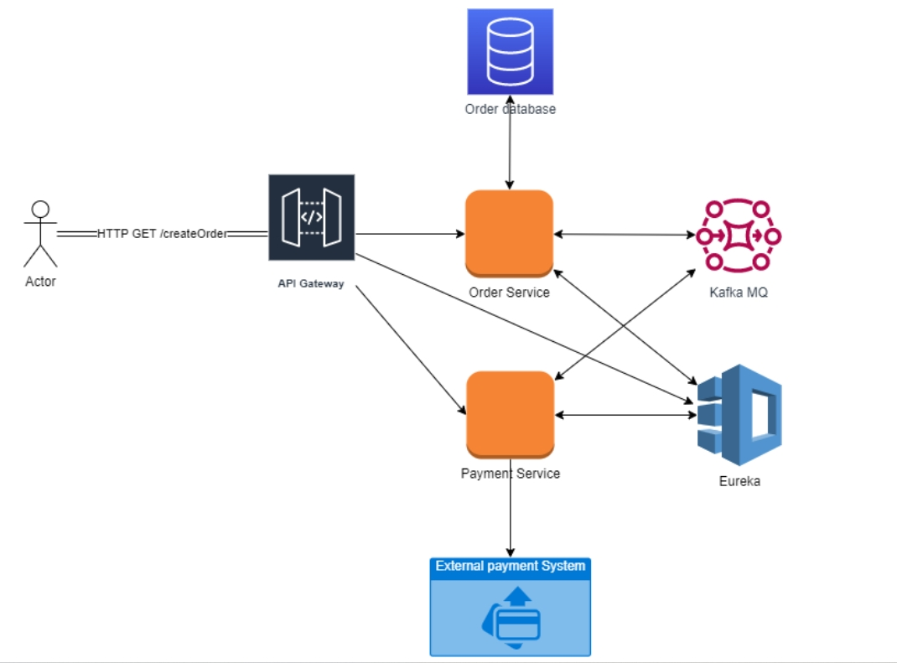
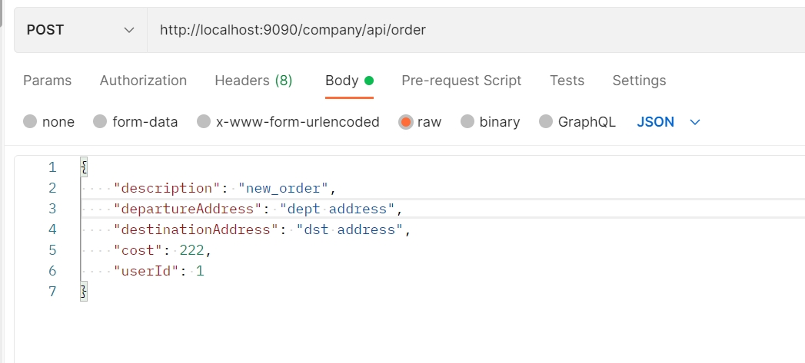

# Logistics System
---
Мультимодульное Spring приложение, реализующее распределенную транзакцию по паттерну "Saga Choreography".

## Стек используемых технологий:
- SpringBoot(Data/Cloud/Config/Stream)
- PostgreSQL
- Kafka
---
## Структура проекта
Для разработки системы используется микросервисная архитектура из
следующих двух сервисов:
- Order Service — хранит информацию о заказах. Обработка нового заказа
начинается с обращения к REST API этого сервиса.
- Payment Service — ответственен за оплату заказа.
---
Помимо этих двух сервисов, ответственных за бизнес-логику, есть два системных
сервиса:
- Discovery and configuration Service — ответственен за передачу сервисам
  настроек и обнаружение сервисами друг друга. Создан на основе Spring Cloud
  Config и Spring Cloud Eureka.
- API Gateway — объединяет API всех сервисов системы. Ответственен за
  маршрутизацию запросов на нужный сервис и
  балансировку нагрузки. Сервис создан на основе Spring Cloud Gateway.
---
Взаимодействие между сервисами происходит асинхронно посредством механизма Spring-Cloud-Stream-Kafka.

---
## Запуск проекта локально
В корне проекта расположен файл docker-compose.yml, где описан сервер БД
PostgreSQL с отдельными базами данных для каждого сервиса системы, и брокер
сообщений Apache Kafka. Работу с проектом нужно начинать с запуска сервисов из
этого файла при помощи Docker Compose.

После этого нужно запустить приложения из следующих трёх модулей:

- **Модуль Discovery**. Его нужно запускать раньше остальных. В нём расположен
  сервис обнаружения Eureka и сервис конфигурирования, который будет
  предоставлять настройки всем запускаемым приложениям в системе.
- **Модуль Gateway**. Доступ к REST API всех сервисов системы должен
  происходить через приложение Spring Cloud Gateway, которое находится в этом
  модуле.
- **Модуль Order-service**. После запуска этого сервиса необходимо выдержать некоторое время (~ 1 мин), пока сервис регистрируется в Eureka.
- **Модуль Payment-service**.

После этого приложение готово к использованию. Ниже показан тестовый запрос в Postman, запускающий транзакцию в саге.

[В начало](#top)